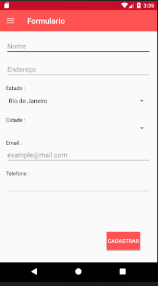
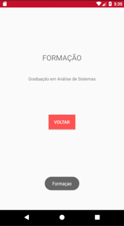

# Formulário android
Projeto para desenvolvimento de uma interface simples em android usando boas práticas e um ícone menu. Contudo não uma lógica de programação por trás do projeto, apenas no que se remete alguns ícones de interface.
## Screenshots

## Detalhes
+ Princípios do design de interfaces.
+ Uso dos princípios de Material design.
+ Uso de menu hamburguer com ícones.
+ Atividades acessadas através de menu.
+ Botão para voltar as informações anteriores.
## Bibliotecas
+ com.android.support.constraint:constraint-layout:1.0.2
+ com.android.support:design:26.1.0
## Requisitos
+ API SDK 26
+ API SDK versão mínima 15
## Licença
Código lançado sob a [MIT License](https://github.com/Nabucodono5or/Formulario/blob/master/LICENSE)
